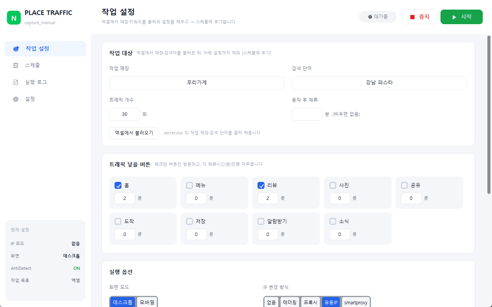
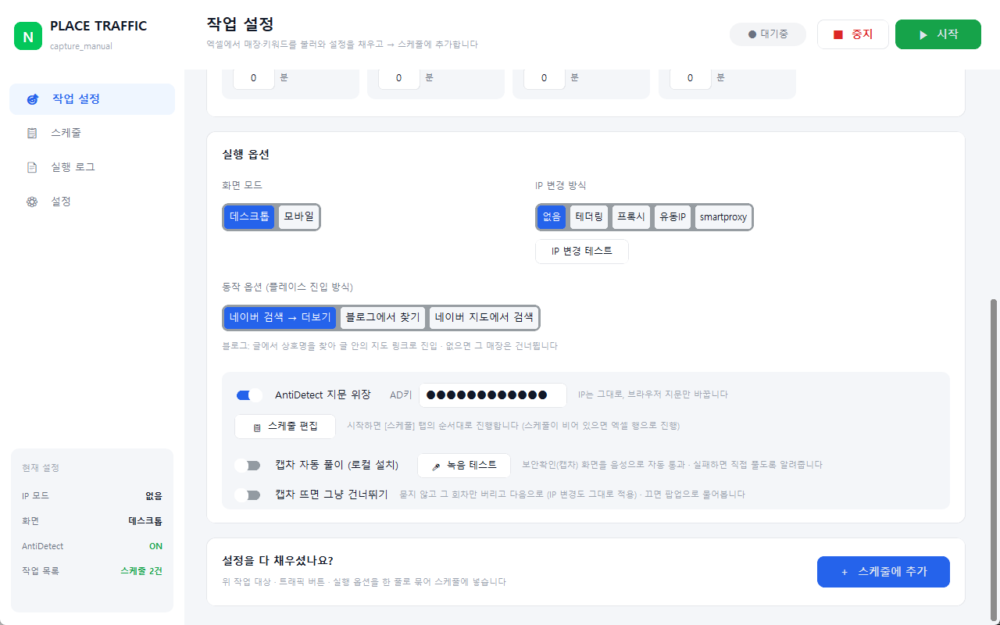
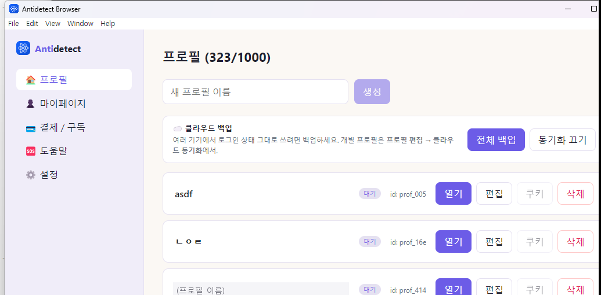
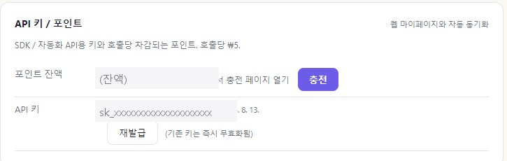
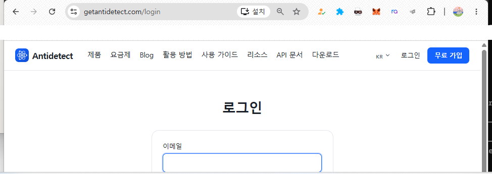
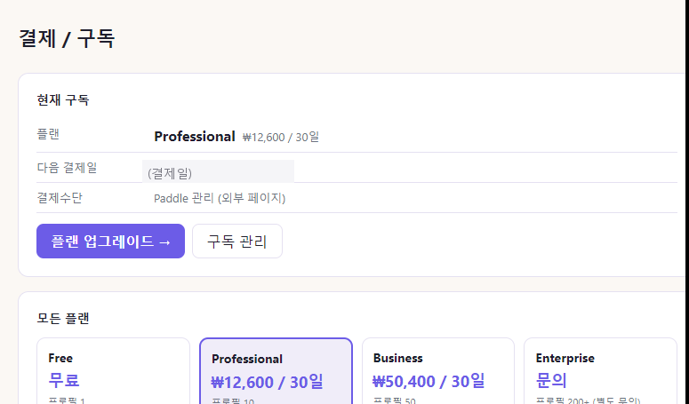
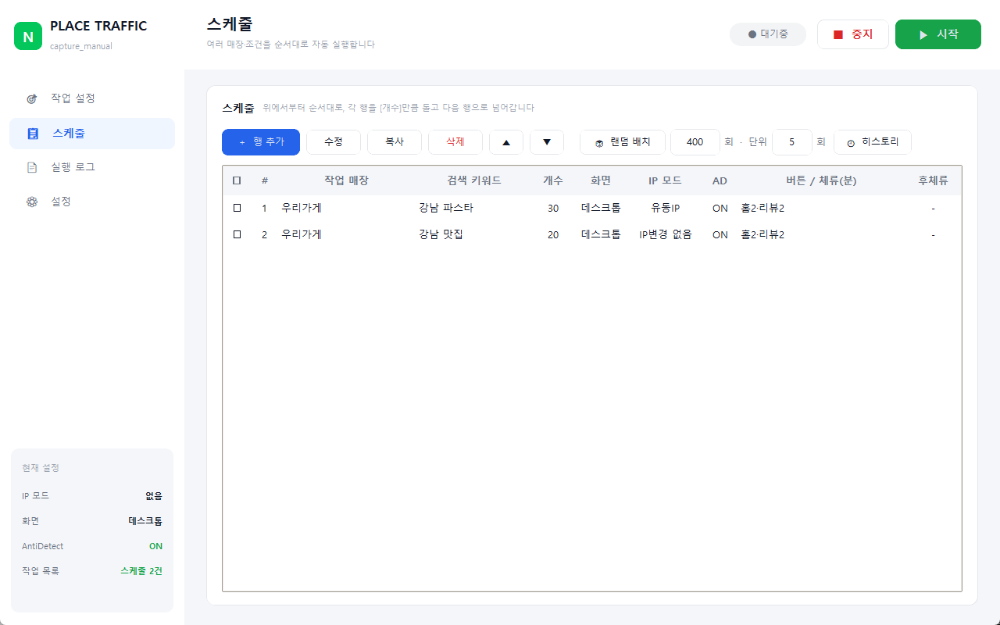
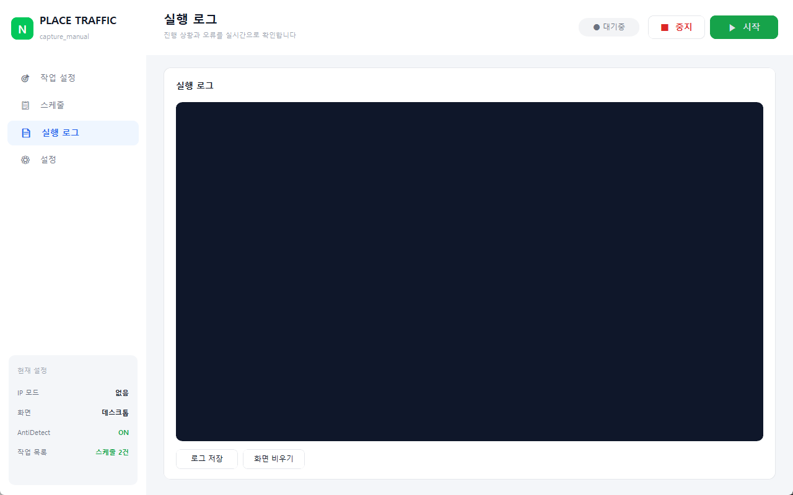
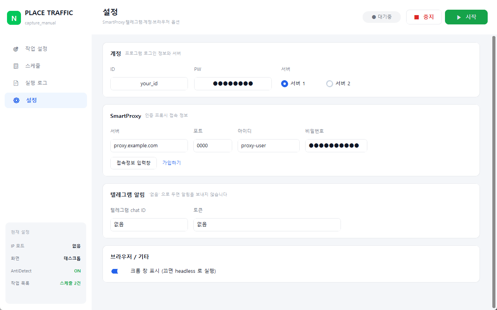

# PLACE TRAFFIC 사용설명서

프로그램 화면을 하나씩 짚어가며 설명합니다. 처음 쓰시는 분은 위에서부터 순서대로 따라 하시면 됩니다.

- [1. 설치와 첫 실행](#1-설치와-첫-실행)
- [2. 작업 설정 — 무엇을 할지 정하기](#2-작업-설정--무엇을-할지-정하기)
- [3. 실행 옵션 — 어떻게 돌릴지 정하기](#3-실행-옵션--어떻게-돌릴지-정하기)
- [4. 스케줄 — 여러 건을 줄 세우기](#4-스케줄--여러-건을-줄-세우기)
- [5. 실행 로그 — 돌아가는 상황 보기](#5-실행-로그--돌아가는-상황-보기)
- [6. 설정 — 계정·프록시·캡차](#6-설정--계정프록시캡차)
- [7. 자주 묻는 것](#7-자주-묻는-것)

---

## 1. 설치와 첫 실행

1. [PlaceLauncherV10.exe 내려받기](https://github.com/hihiood/place-launcher/releases/latest/download/PlaceLauncherV10.exe)
2. 받은 파일을 실행합니다.
3. **"Windows의 PC 보호" 경고가 뜨면** `추가 정보` → `실행` 을 누르세요.
   코드 서명이 없어서 나오는 안내이며 실행에는 문제가 없습니다.
4. 처음 실행할 때는 프로그램 파일을 내려받으므로 잠시 기다려 주세요.

> **필요한 것** — Windows 10 이상 · Google Chrome 설치 · 인터넷 연결

---

## 2. 작업 설정 — 무엇을 할지 정하기

프로그램을 켜면 처음 보이는 화면입니다.



### 작업 대상

| 항목 | 설명 |
|---|---|
| **작업 매장** | 네이버 플레이스에 등록된 **정확한 상호명**. 목록에서 이 이름과 똑같은 매장을 찾습니다 |
| **검색 단어** | 네이버에 검색할 키워드 (예: `강남 파스타`) |
| **트래픽 개수** | 몇 회 반복할지 |
| **동작 후 체류** | 모든 버튼을 다 누른 뒤 추가로 머무를 시간(분). 비우면 없음 |

**상호명은 정확해야 합니다.** 목록에 표시되는 이름과 글자 하나라도 다르면 못 찾습니다.

`엑셀에서 불러오기` 를 누르면 `secret.xlsx` 의 **작업 매장 / 검색 단어** 를 골라 채워줍니다.

#### 엑셀 파일 준비하기

프로그램은 실행 파일과 **같은 폴더**에 있는 `secret.xlsx` 를 읽습니다.
아래 템플릿을 받아 매장 정보만 채워 넣으세요.

### **[📄 secret.xlsx 템플릿 내려받기](https://github.com/hihiood/place-launcher/raw/main/docs/secret_%ED%85%9C%ED%94%8C%EB%A6%BF.xlsx)**

받은 파일의 이름을 **`secret.xlsx`** 로 바꿔 실행 파일 옆에 두시면 됩니다.

| 열 | 채워야 하나요 | 설명 |
|---|---|---|
| **작업 매장** | **필수** | 플레이스에 등록된 정확한 상호명 |
| **검색 단어** | **필수** | 네이버에 검색할 키워드 |
| 나머지 (체류시간 · 동작 개수 · 텔레그램) | 선택 | 비워두면 기본값으로 채워집니다 |

> **헤더(첫 줄)는 지우지 마세요.** 프로그램이 이 이름으로 열을 찾습니다.
> 템플릿에 들어있는 예시 한 줄(`우리가게 / 강남 파스타`)은 지우고 쓰시면 됩니다.

> 스케줄 기능을 쓰시면 체류시간·개수·IP모드 같은 값은 **스케줄 행이 덮어씁니다.**
> 그래서 엑셀에는 **작업 매장 / 검색 단어** 두 열만 있어도 충분합니다.

### 트래픽 넣을 버튼


체크한 버튼만 방문하고, 각 칸에 적은 **분(分)만큼 머무릅니다.**

홈 · 메뉴 · 리뷰 · 사진 · 공유 · 도착 · 저장 · 알림받기 · 소식 중에서 고르시면 됩니다.

> 체크를 안 한 버튼은 아예 방문하지 않습니다. 체류시간 `0` 은 들어갔다 바로 나온다는 뜻입니다.

---

## 3. 실행 옵션 — 어떻게 돌릴지 정하기



### 화면 모드

| 모드 | 설명 |
|---|---|
| **데스크톱** | PC 화면으로 검색합니다 |
| **모바일** | 휴대폰 화면으로 검색합니다. 순위가 데스크톱과 다를 수 있습니다 |

> 데스크톱으로 돌리다 네이버 지도가 목록을 주지 않으면, 프로그램이 **그 스케줄에 한해 자동으로 모바일로 전환**합니다.

### IP 변경 방식

| 방식 | 설명 |
|---|---|
| **없음** | IP 를 바꾸지 않습니다 |
| **테더링** | 휴대폰 USB 테더링 · 비행기모드를 껐다 켜서 IP 를 바꿉니다 |
| **프록시** | `프록시유동_하이아이피.txt` 목록을 돌려 씁니다 |
| **유동IP** | 보나넷 등 유동IP 프로그램의 단축키를 눌러 바꿉니다 |
| **smartproxy** | 인증 프록시를 씁니다 ([설정] 탭에서 접속 정보 입력) |

`IP 변경 테스트` 로 실제로 바뀌는지 미리 확인할 수 있습니다.

### 동작 옵션 (플레이스 진입 방식)

매장 상세 페이지에 **어떤 경로로 들어갈지** 정합니다.

| 방식 | 설명 |
|---|---|
| **네이버 검색 → 더보기** | 검색 결과에서 목록으로 들어가 매장을 찾습니다 (기본) |
| **블로그에서 찾기** | 블로그 글을 열어 글 안의 지도 링크로 매장에 들어갑니다 |
| **네이버 지도에서 검색** | 지도에서 바로 검색합니다 |

#### 블로그에서 찾기 — 쓰려면 두 조건이 맞아야 합니다

예를 들어 `강남 맛집` 으로 돌린다면:

1. **네이버에 `강남 맛집` 을 검색했을 때 블로그 탭에 내 글이 있어야 하고**
2. **그 글 안에 내 가게가 플레이스(지도 카드)로 삽입돼 있어야** 합니다

이 두 가지가 맞으면 프로그램이 글을 찾아 들어가 지도 카드를 눌러 매장으로 이동합니다.

> **상호만 글자로 적혀 있으면 안 됩니다.** 지도 카드가 실제로 들어가 있어야 합니다.
> 조건이 안 맞으면 그 매장은 건너뜁니다 (트래픽 횟수는 소모되지 않습니다).

### AntiDetect 지문 위장

> **먼저 알아두실 것 — 이건 선택 사항입니다.**
> 안 켜도 프로그램은 정상으로 돕니다. 별도 프로그램 설치와 유료 결제가 필요하니
> **"지문까지 더 깊게 바꾸고 싶을 때 쓰는 것"** 정도로 보시면 됩니다.

#### 지문이 뭔가요

같은 컴퓨터에서 브라우저를 켜면 **GPU · CPU · 메모리 · 화면 크기 · 글꼴** 같은 정보가
늘 똑같이 나갑니다. 사이트는 이걸 모아 "같은 사람" 으로 알아봅니다. 이걸 **브라우저 지문**이라고 합니다.

AntiDetect 는 이 값들을 매번 다르게 만들어 줍니다.
**IP 는 그대로**이고 브라우저 쪽만 달라집니다.

> 오류를 줄여주는 기능이 아니라, **같은 환경에서 작업하는 티를 줄이는** 기능입니다.

> 모바일 모드와 같이 쓰면 **안드로이드 지문**으로 접속합니다.
> (UA · 화면 · 터치뿐 아니라 WebGL 렌더러까지 모바일 GPU 로 나갑니다)

#### 쓰려면 네 가지가 필요합니다

##### 1) AntiDetect Browser 설치 + 가입

[getantidetect.com](https://getantidetect.com) 에서 가입하고 프로그램을 설치합니다.
**작업을 돌리는 PC(원격이면 원격 PC)에 설치**해야 합니다.

##### 2) 앱 활성화 — "앱 로그인 키"

설치 후 앱을 처음 켜면 **앱 로그인 키**를 넣어 활성화해야 합니다.
이 키는 홈페이지 **마이페이지**에 있습니다. 그대로 복사해 붙여넣으면 됩니다.

> **앱 로그인 키**(앱을 켜는 열쇠)와 **API 키**(우리 프로그램이 쓰는 열쇠)는 **서로 다릅니다.**
> 둘 다 마이페이지에 있지만 쓰는 곳이 다릅니다.

| 키 | 어디에 넣나 |
|---|---|
| **앱 로그인 키** (`ADP-...`) | AntiDetect **앱** 활성화 화면 |
| **API 키** (`sk_...`) | 우리 프로그램의 **`AD키`** 칸 |

##### 3) AntiDetect Browser 가 실행 중이어야 합니다

켜두기만 하면 되고, 창을 따로 조작할 필요는 없습니다.



꺼져 있으면 `AntiDetect 프로그램이 실행 중인지 확인해주세요` 라고 나옵니다.

##### 4) API 키를 `AD키` 칸에 넣어야 합니다

AntiDetect Browser 왼쪽 메뉴에서 **`마이페이지`** 를 누르고 아래로 조금 내리면
**`API 키 / 포인트`** 카드가 있습니다.



| 항목 | 설명 |
|---|---|
| **포인트 잔액** | 호출당 차감됩니다 (호출당 ₩5) |
| **API 키** | `sk_` 로 시작하는 값. 이걸 복사해 `AD키` 칸에 붙여넣습니다 |
| **재발급** | 키를 새로 만듭니다. **기존 키는 즉시 무효**가 되니 주의하세요 |

키를 넣고 `AntiDetect 지문 위장` 토글을 켜면 유효성을 확인하고 `연결 성공` 이 뜹니다.

> **주의** — API 키는 비밀번호와 같습니다. 남에게 보여주거나 캡처를 공유하지 마세요.
> 포인트가 차감되는 값이라 유출되면 다른 사람이 대신 써버릴 수 있습니다.

##### 5) 포인트가 있어야 합니다 (충전)

**API 는 호출할 때마다 포인트가 차감됩니다.** 잔액이 0 이 되면
`잔액 부족 — 대시보드에서 충전 후 다시 시도해주세요` 가 뜨고 더 이상 안 돕니다.

`API 키 / 포인트` 카드의 **`충전`** 버튼을 누르면 브라우저로 충전 페이지가 열립니다.



1. 열린 페이지에서 **로그인** 합니다 (앱에 쓰는 계정과 같습니다)
2. 웹 마이페이지에서 포인트를 충전합니다
3. 앱으로 돌아오면 잔액이 자동으로 갱신됩니다

> 충전은 앱 안에서가 아니라 **브라우저(getantidetect.com)에서** 진행됩니다.

##### 참고 — 구독 플랜

포인트(API 호출)와 별개로, 프로필 개수 등은 구독 플랜에 따라 달라집니다.
`결제 / 구독` 메뉴에서 확인할 수 있습니다.



> 이 프로그램을 쓰는 데는 **포인트(API 호출)** 가 핵심입니다.
> 플랜은 AntiDetect 를 직접 쓰실 때 관련됩니다.

#### 자주 나오는 메시지

| 메시지 | 뜻 |
|---|---|
| `API 키가 올바른지 확인해주세요` | 키가 틀렸거나 재발급으로 무효가 된 상태 |
| `잔액 부족 — 대시보드에서 충전 후 다시 시도` | 포인트를 충전해야 합니다 |
| `프로그램이 실행 중인지 확인해주세요` | AntiDetect Browser 가 꺼져 있습니다 |
| `요청 제한 초과 — 잠시 후 다시 시도` | 짧은 시간에 너무 많이 호출했습니다 |

### 캡차 관련 토글 두 개

**캡차**는 네이버가 "사람이 맞나요?" 하고 띄우는 **보안 확인 화면**입니다.
영수증 숫자를 묻거나 이미지를 고르라고 합니다.

> **자주 뜨지는 않습니다.** 대부분은 신경 쓸 일이 없고, 뜰 때만 아래 설정이 쓰입니다.

| 토글 | 켜면 | 기본값 |
|---|---|---|
| **캡차 자동 풀이 (로컬 설치)** | 캡차를 **음성으로 자동 통과**합니다. 처음 한 번 설치가 필요합니다 | 꺼짐 |
| **캡차 뜨면 그냥 건너뛰기** | 묻지 않고 그 회차만 버리고 다음으로 넘어갑니다 (IP 변경도 그대로 적용) | 꺼짐 |

둘 다 끄면 캡차가 떴을 때 **팝업으로 물어봅니다.**

```
[다시 시도]  크롬 창에서 직접 푸신 뒤 누르세요
[무시]        이번 회차만 건너뜁니다
[중단]        작업을 멈춥니다
```

> 자리를 비우실 거라면 **`캡차 뜨면 그냥 건너뛰기`를 켜두세요.**
> 안 그러면 팝업이 뜬 채로 프로그램이 사람을 기다립니다.

---

## 4. 스케줄 — 여러 건을 줄 세우기

설정을 다 채우고 `+ 스케줄에 추가` 를 누르면 한 줄이 쌓입니다.



위에서부터 순서대로, 각 행을 `개수` 만큼 돌고 다음 행으로 넘어갑니다.

| 버튼 | 설명 |
|---|---|
| **행 추가 / 수정 / 복사 / 삭제** | 행 관리. 체크박스로 여러 개 한 번에 삭제할 수 있습니다 |
| **▲ ▼** | 순서 바꾸기 |
| **랜덤 배치** | 총 횟수를 잘게 쪼개 키워드를 번갈아 돌립니다 |
| **히스토리** | 지난 스케줄을 불러옵니다 (최대 10개 보관) |

### 랜덤 배치가 하는 일

`400회`를 `단위 5회` 로 배치하면, **5회씩 80묶음**으로 쪼개 키워드를 번갈아 돕니다.
한 매장에 몰아서 넣지 않는 것이 핵심입니다. 연속으로 같은 키워드가 오지 않게 섞어줍니다.

### 중간에 멈췄다면

`중지` 후 다시 `시작` 을 누르면 **"이어서 하시겠습니까?"** 를 물어봅니다.
`예` 를 누르면 중단된 지점부터, `아니오` 를 누르면 처음부터 시작합니다.

---

## 5. 실행 로그 — 돌아가는 상황 보기



진행 상황이 실시간으로 올라옵니다.

```
[1/3행] 진행중 10번째 / 400회  (성공 8 · 실패 2)
```

| 표기 | 뜻 |
|---|---|
| `[1/3행]` | 스케줄 3행 중 1행째 |
| `진행중 10번째 / 400회` | 전체 400회 중 10번째를 돌고 있음 |
| `(성공 8 · 실패 2)` | 매장을 찾아 체류까지 끝낸 횟수 / 못 찾거나 오류로 버려진 횟수 |

자주 보게 되는 줄들:

| 로그 | 뜻 |
|---|---|
| `변경된 IP : …` | IP 가 바뀌었습니다 |
| `[모바일] 찾음 — 8위` | 목록에서 매장을 8위로 찾았습니다 |
| `현재 순위 : 8` | 이번 회차에 기록된 순위 |
| `홈 버튼 체류시간 : 82 초` | 홈 탭에 82초 머물렀습니다 |
| `[자동전환] …모바일로 진행합니다` | 데스크톱이 목록을 못 받아 모바일로 바꿉니다 |
| `[캡차] 보안 확인 화면 감지` | 캡차가 떴습니다 |

`로그 저장` 으로 파일로 남기고, `화면 비우기` 로 지울 수 있습니다.

---

## 6. 설정 — 계정·프록시·캡차


| 항목 | 설명 |
|---|---|
| **계정** | 프로그램 로그인 ID / PW, 접속 서버 선택 |
| **SmartProxy** | 인증 프록시 접속 정보 (서버 · 포트 · 아이디 · 비밀번호) |
| **텔레그램 알림** | 진행 상황을 텔레그램으로 받습니다. `없음` 으로 두면 안 보냅니다 |
| **크롬 창 표시** | 끄면 화면 없이(headless) 돕니다 |



### SmartProxy 를 쓰신다면

IP 차단 없이 돌리시려면 로테이팅 주거용 프록시를 쓰는 방법이 있습니다.

**[SmartProxy 가입하기 (추천 코드 적용)](https://www.smartproxy.org/register/?invitation_code=UH9MV9)**

> 위 링크로 가입하시면 **데이터 10% 를 더 받습니다.** (추천 코드 `UH9MV9`)

가입 후 받은 접속 정보를 `[설정] → SmartProxy` 에 넣고,
`[작업 설정] → IP 변경 방식` 에서 `smartproxy` 를 고르시면 됩니다.

---

## 7. 자주 묻는 것

**Q. AntiDetect 를 꼭 써야 하나요?**
아니요. **선택 사항입니다.** 안 켜도 프로그램은 정상으로 돕니다.
같은 환경에서 작업하는 티를 줄이고 싶을 때 쓰는 기능이고, 별도 설치와 유료 결제가 필요합니다.

**Q. 앱 로그인 키와 API 키가 뭐가 다른가요?**
둘 다 AntiDetect 마이페이지에 있지만 쓰는 곳이 다릅니다.
`ADP-` 로 시작하는 **앱 로그인 키**는 AntiDetect **앱을 활성화**할 때,
`sk_` 로 시작하는 **API 키**는 우리 프로그램의 **`AD키` 칸**에 넣습니다.

**Q. AntiDetect 는 구독을 결제해야 돌아가나요?**
API 호출은 **포인트**로 차감됩니다. 포인트가 있어야 동작하고, 없으면 `잔액 부족` 이 뜹니다.
구독 플랜은 프로필 개수 등 AntiDetect 자체 기능에 관련된 것이라 우리 프로그램과는 별개입니다.

**Q. 캡차는 자주 뜨나요?**
자주 뜨지는 않습니다. 대부분은 신경 쓸 일이 없습니다.
자리를 비우실 거라면 `캡차 뜨면 그냥 건너뛰기` 만 켜두시면 됩니다.

**Q. 블로그에서 찾기가 계속 건너뜁니다**
① 그 키워드로 검색했을 때 블로그 탭에 **내 글이 있는지**,
② 그 글에 **내 가게가 플레이스(지도 카드)로 삽입돼 있는지** 확인해 주세요.
상호만 글자로 적힌 글로는 동작하지 않습니다.

**Q. 매장을 못 찾는다고 나옵니다**
상호명이 목록에 표시되는 이름과 정확히 같은지 확인해 주세요. 띄어쓰기도 같아야 합니다.
그래도 안 되면 그 키워드 검색 결과에 매장이 실제로 노출되는지 직접 확인해 보세요.

**Q. 캡차가 자주 뜹니다**
`[설정] → 캡차 자동 풀이` 를 켜시면 음성으로 자동 통과합니다(처음 한 번 설치 필요).
자리를 비우실 거라면 `캡차 뜨면 그냥 건너뛰기` 를 켜두세요.

**Q. 실패 횟수가 올라갑니다**
매장을 못 찾았거나 오류로 버려진 회차입니다. 실행 로그를 보시면 어느 단계에서 멈췄는지 나옵니다.

**Q. 데스크톱으로 했는데 모바일로 바뀌었습니다**
네이버 지도가 목록을 주지 않을 때 프로그램이 자동으로 전환한 것입니다. 정상 동작입니다.
저장된 스케줄 설정은 그대로이고, 다음에 다시 시작하면 데스크톱부터 시도합니다.

**Q. 프로그램이 멈춘 것 같습니다**
체류 시간 동안에는 로그가 늘지 않습니다. 몇 분 기다려 보시고,
캡차 팝업이 떠 있지 않은지도 확인해 주세요 — 팝업은 답하기 전까지 기다립니다.

---

문제가 있으면 [Issues](https://github.com/hihiood/place-launcher/issues) 에 남겨주세요.
